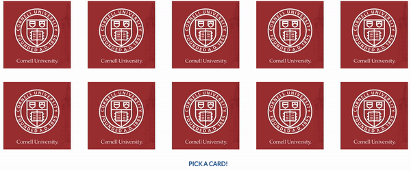

# Memory Game

 

A memory game featuring an randomly generated sequence of images. Pair all the images correctly by clicking on each image to win the game!

Game is initialized with default images of the Cornell logo, which flip to reveal other images when clicked upon. If two images are successfully paired, they will be replaced by an image of a happy mascot (Touchdown the Bear). 

Prompts will guide user through the gameplay. Have fun. :)

### Authors

Huang Sijia Linda, Yang Shen
